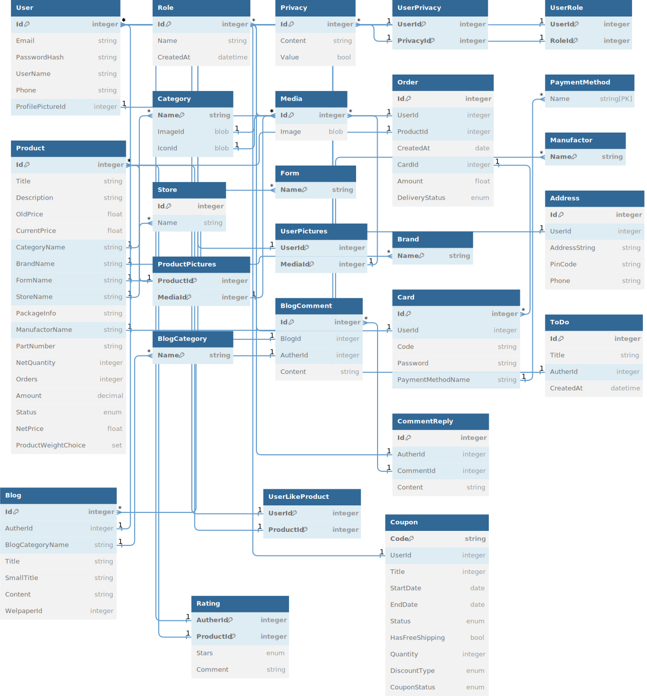

# FastKart-Project 🛒

## Description :
Fastkart is an innovative online platform designed to revolutionize the way food products are shipped and delivered to customers. This web application provides a seamless and user-friendly experience, enabling customers to easily browse, select, and order a wide range of food products for delivery right to their doorstep. Fastkart's exceptional features are made possible through its robust technology stack, combining the power of React and .NET in ASP.NET Core.

## Front-End tech stack :
- **React** : Fastkart employs React ⚛️, a JavaScript library, to create modular UI components for seamless navigation and interactive user experiences.
- **Tailwind CSS**: Utilizing Tailwind CSS 🎨, Fastkart achieves consistent and efficient styling through utility classes, ensuring a responsive design across devices.

## Back-End tech stack :
- **ASP.NET Core**: Fastkart's backend is powered by ASP.NET Core 🌐, offering a robust and high-performance 🚀 foundation for handling core functionalities and requests.
- **Entity Framework**: Leveraging Entity Framework 🏗️, Fastkart ensures efficient database interactions and data management, simplifying the handling of essential data operations.
- **SQL Server (Production)**: Fastkart utilizes SQL Server 🛢️ for production, ensuring a scalable and secure database environment to support seamless operations and data integrity.
- **SQLite (Testing)**: During testing, Fastkart employs SQLite 📦 to facilitate rapid and isolated testing, enabling developers to ensure reliability and accuracy in a controlled environment.

## Database Schema:
The foundation of Fastkart's operations lies in its comprehensive database schema. The database is designed using Entity Framework, an object-relational mapping (ORM) framework that simplifies database interactions. Here's a glimpse of the database schema:

## Database Schema Implementation ( Classes & Models ) :
Fastkart's robust database schema is the backbone of its efficient operations. Each class within the schema is meticulously designed to capture essential data points, ensuring seamless functionality and accurate information management.

- Product Class As Example :
<pre>
public class Product
{
    public int Id { get; set; }
    public string Title { get; set; }
    public string Discription { get; set; }
    public float OldPrice { get; set; }
    public float CurrentPrice { get; set; }
    public string CategoryName { get; set; }
    public Category Category { get; set; }
    public string BrandName { get; set; }
    public Brand Brand { get; set; }
    public string FormName { get; set; }
    public Form Form { get; set; }
    public string StoreName { get; set; }
    public Store Store { get; set; }
    public string PackageInfo { get; set; }
    public string ManufactorName { get; set; }
    public Manufactor Manufactor { get; set; }
    public string PartNumber { get; set; }
    public int NetQuantity { get; set; }
    public decimal Amount { get; set; }
    public ProductStatus Status { get; set; }
    public float NetPrice { get; set; }
    public List<Media> ProductPictures { get; set; }
    public List<User> Likers { get; set; }
    public List<Order> Orders { get; set; }
    public List<Rating> Ratings { get; set; }
}
</pre>

For All Classes Implementation , You Can See : [Entities](https://github.com/bouzidkobchi/FastKart-Project/tree/main/Data/Entities) .

- Configuring Product Class As Example :
<pre>
public static class ProductConfig
{
    public static ModelBuilder AddProductEntity(this ModelBuilder modelBuilder)
    {
        var ProductEntity = modelBuilder.Entity<Product>();

        // Title
        ProductEntity.Property(P => P.Title)
            .IsRequired()
            .HasMaxLength(100);

        // Discription
        ProductEntity.Property(P => P.Discription)
            .HasMaxLength(2000);

        // Category
        ProductEntity.HasOne(P => P.Category)
            .WithMany(C => C.Products)
            .HasForeignKey(P => P.CategoryName);

        // Brand
        ProductEntity.HasOne(P => P.Brand)
            .WithMany(B => B.Products)
            .HasForeignKey(P => P.BrandName);

        // other properties available in the source code up .

        return modelBuilder;
    }
}
</pre>

in modelBuilder :
<pre>
protected override void OnModelCreating(ModelBuilder modelBuilder)
{
    modelBuilder
        .AddProductEntity();
        // and other entities .
}
</pre>

For All Entities Configuration , You Can See : [Entities Configuration](https://github.com/bouzidkobchi/FastKart-Project/tree/main/Data/EntitiesConfiguration)

## Swagger-Powered API Documentation 📚🚀
Fastkart's Swagger UI documentation offers developers a comprehensive guide to seamlessly integrate, enhance, and leverage our APIs. Simplify development and maximize potential with Fastkart's API documentation.

